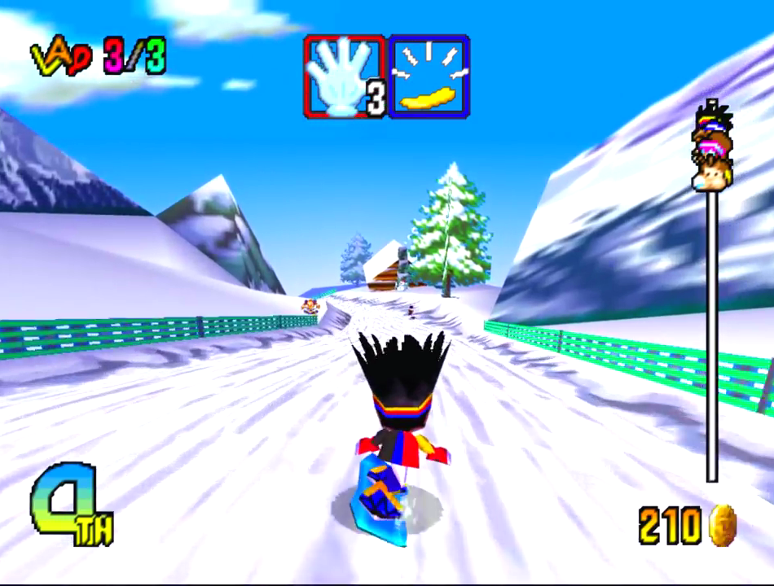
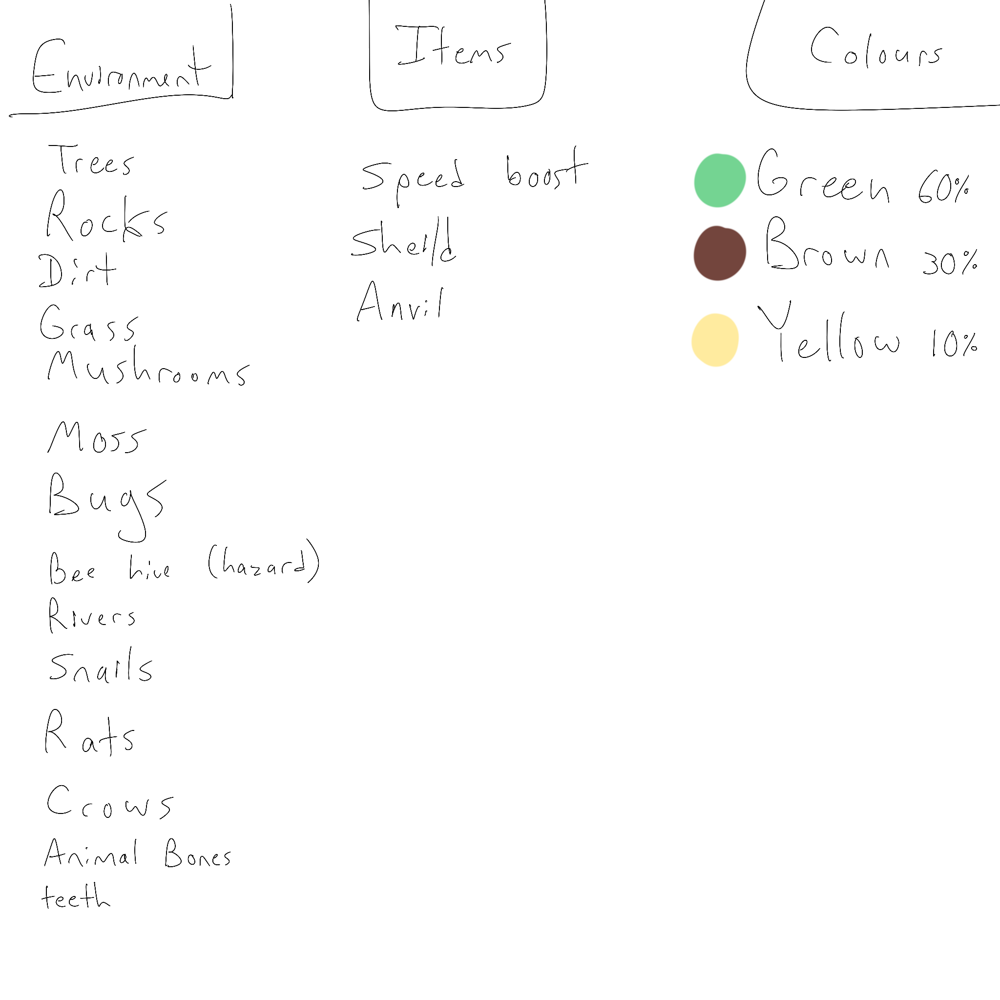

## Design Pillars
| Chaos                                                                                 | Toy/Fun on contact                                                                                                            | Humor                                                                                                                                   |
| ------------------------------------------------------------------------------------- | ----------------------------------------------------------------------------------------------------------------------------- | --------------------------------------------------------------------------------------------------------------------------------------- |
| goblins are mischievous.  We want to create a chaotic feeling. Fast paced and clumsy. | We want the game to "feel good" on first contact. Easy to understand and fun to play with without rules or scores being added | We want people to laugh. Situations that create tension and relief are what we are looking for. If people are laughing we are suceeding |
## Elevator pitch
Goblins are escaping down hill! They've stolen a valuable staff from a wizard, there is only one staff and they don't want to share. Whoever reaches the bottom of the hill with the staff gets too keep it! But watch out, the mountain is full of hazards, and the wizard is not pleased!

## Art Direction
Low poly.
Pointy models.
Realistic textures.
Accessible for people with visual impairments.

## Inspiration

Zelda Majora's Mask/Ocarina of Time
https://www.reddit.com/r/goblincore/
Rayman (for limbs of character)
https://vgen.co/Sarccatto/portfolio
https://store.steampowered.com/app/2533600/Bloodthief/

## Environment Items Colours

## Minimum Viable Product
- Two goblins going down hill
- Split screen camera 
- Orb based player models
- 2-3 Obstacles
	- Ramp
	- Rail
	- Bumper
	- Rock/tree

## What Medium Product
- Power-up / weapons
## Controls
| Button | Action                                         |
| ------ | ---------------------------------------------- |
| Up     | Accelerate                                     |
| Down   | Lean back / slow down (Turn Board Horizontal?) |
| Left   | Move left                                      |
| Right  | Move right                                     |
| A      | Jump                                           |
| B      | Bash / action                                  |

## Audience
- Casual players
	- Simple controls
	- Easy to understand
- Capital G Gamers
	- More subtle control / complexity when comfort is built up
	- Still competitive
- Not for:
	- Racing purists/ enthusiasts
	- Dark souls lovers, we want the difficulty to be in the competition and keep the game approachable

## What Programmer Needs
- A simple goblin object
- separate board object
- One level

## What Artist Needs

## Assets we need
| complete (add an X when done) | asset       |
| ----------------------------- | ----------- |
|                               | Goblin Head |
|                               | Goblin Body |
|                               | Board/Log   |
|                               | Hands/Feet  |
|                               | Rock        |
|                               | Tree        |
|                               | Ramp        |
|                               | Rail        |
|                               |             |

## Juice
How do we want to adjust movement, cameras, sounds, character movement to create the feel we want

### Player Movement
- smooth the ground alignment
- goblin needs to recognize certain events and provide signals for the camera to respond to:
	- impacts
	- landing
	- direction the player is moving towards
- similar questions for what events the goblin needs to respond to with animations

### Camera
Simple implementations
- Acceleration
	- Pull camera back and reduce FOV
- Have the camera sway behind the player in response to which direction the player is moving towards, and return to centered while player has no change in direction. This is including up and down
- Raycast downward to prevent clipping through ground

Complex implementations
- Turning
	- Have camera away from the direction the player is turning
- Impacts
	- Shake the camera
	- When both players collide freeze the game for an instant
	- When a player hits another with a melee weapon freeze the game for an instant and make the player who was hurt have screen shake
- Jumping
	- Have the camera raise slightly during start up frames, then move slightly above character during jumping and air time
- Landing
	- Have the camera "bounce" downwards before returning to normal horizontal

### Menus & Overlays
- start race animation (Ready Set Go?)
- Goblin One Wins! type display (maybe 3D effects for celebration? does it shoot out skulls & bones in place of confetti?)
- Goblin Ready display to help players understand they have to push a button to start (Might be assisted with animation on Goblin / camera)
- Press Button to Start display for same reason
	- But don't put too much into this because we might have to redesign for map select screen
- Timer: shows seconds of race

### Animation/Particle Effects
- Puffs of snow/dust on landing
- a wake behind the snowboard
- crushed grass
- power up particles
- pain stars
- Speed trails
- 
### Sounds
If a sound is constant it needs to change enough to not be annoying. We want our game to sound?
- Cartoony
- 
What noises do we need
- Sliding noise 
	- Variable for different terrains/grinds
	- Not monotonous 
	- hushed when riding through grass
- impact thuds
	- bumping players
	- bumping obstacles
	- landing a jump
- goblin voice lines and grunts
	- Taunt?
	- bumping player
	- successfully using item
	- whiffing item
- wipe-out sounds
- race start
- winner!
- race over
- power up sounds
- grinding sounds
- build up sound when going off ramp
	- Change the slide sound to sound like the ramp?
	- 
